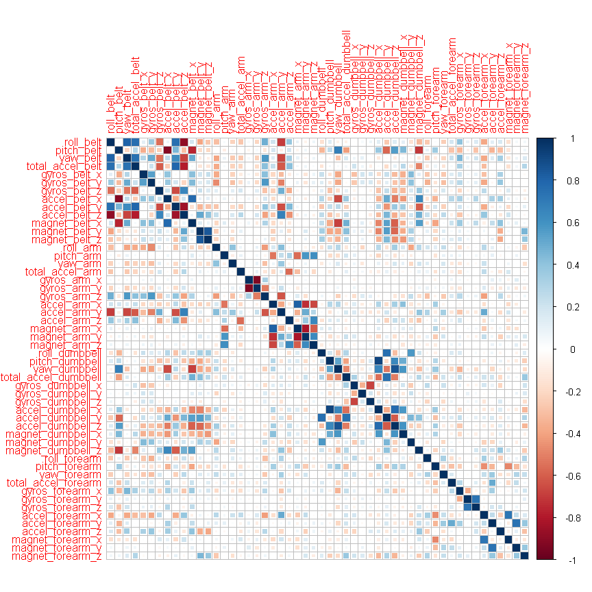

# Activity Prediction
Efremov Victor  
Sunday, July 26, 2015  

##Executive Summary

The goal of this work is to predict the manner in which people did the exercise. 
For this, we use  data from accelerometers on the belt, forearm, arm, and 
dumbell from 6 participants. People were asked to perform barbell lifts 
correctly and incorrectly in 5 different ways. 

We build a machine learning algorithm that predicted with high accuracy the 
manner in which the participants did the exercise. Algorithm based on a Random 
Forest model. This algorithm have accuracy 0.989, and correctly predicted all 
test cases.

##Data Processing

###Data loading:

Download the dataset:


```r
# Download dataset
url_training <- "http://d396qusza40orc.cloudfront.net/predmachlearn/pml-training.csv"
url_test <- "http://d396qusza40orc.cloudfront.net/predmachlearn/pml-testing.csv"
download.file(url_training, "pml-training.csv")
download.file(url_test, "pml-testing.csv")

# Read this files
DataTraining <- read.csv(file = "pml-training.csv",
                         head=TRUE,
                         na.strings=c("NA", "", "#DIV/0!"),
                         sep=",")

DataTesting <- read.csv(file = "pml-testing.csv",
                         head=TRUE,
                         na.strings=c("NA", "", "#DIV/0!"),
                         sep=",")
```
###Clear the data:

First, remove some useless variables like names of people and date of 
observations (first 7 columns). Additionally, remove ?classe? column from first 
dataset (in order that it does not influence on the statistics.


```r
DataTestingClear <- DataTesting[,-c(1:7,160)]
DataTrainingClear <- DataTraining[,-c(1:7,160)]
```

If we look at quantity of NA values, we find that some of columns have more than 
19000 NA values. So, remove them.


```r
delCol <- which(colSums(is.na(DataTrainingClear)) > 19000)
DataTrainingClear <- DataTrainingClear[, -c(delCol)]
DataTestingClear <- DataTestingClear[, -c(delCol)]
```

Check predictors that have one unique value: there are no such predictors in clean dataset 


```
## Loading required package: lattice
## Loading required package: ggplot2
```

```r
zeroPred <- nearZeroVar(DataTrainingClear)
```

Then, find predictors with high correlation, and remove them:


```r
library(corrplot)

corVar = cor(DataTrainingClear, method = "spearman")
```

```r
# Make square plot of correlation between predictors
corrplot(corVar, method = "square")
```

 

```r
# Find all predictors with koef.of corellation greater than 0.7 by modulus.
highCor = findCorrelation(corVar, cutoff = 0.7)

# And remove them
DataTestingClear = DataTestingClear[, -highCor]
DataTrainingClear = DataTrainingClear[, -highCor]
```

And restore ```classe``` column into clean dataset


```r
DataTrainingClear$classe = DataTraining$classe
```

###Create Machine Learning Model


```r
set.seed(1937)

# split the dataset into a training and test data.
inTrain <- createDataPartition(y=DataTrainingClear$classe, p=0.7, list=FALSE)
training <- DataTrainingClear [inTrain,] 
testing <- DataTrainingClear [-inTrain,] 

# define training control with 10-fold cross-validation
train_control <- trainControl(method = "cv", 
                              number = 10
                              )

# Build the Random Forest model
model <- train(classe ~ ., 
               data = training, 
               trControl = train_control, 
               method = "rf"
               )
```

```
## Loading required package: randomForest
## randomForest 4.6-10
## Type rfNews() to see new features/changes/bug fixes.
```

##Validate Model

Look at confusion matrix:


```r
pred <- predict(model, testing)

confusionMatrix(pred, testing$classe)
```

```
## Confusion Matrix and Statistics
## 
##           Reference
## Prediction    A    B    C    D    E
##          A 1672   23    0    0    0
##          B    0 1115   12    0    0
##          C    1    1 1012   16    0
##          D    0    0    2  946    6
##          E    1    0    0    2 1076
## 
## Overall Statistics
##                                           
##                Accuracy : 0.9891          
##                  95% CI : (0.9861, 0.9916)
##     No Information Rate : 0.2845          
##     P-Value [Acc > NIR] : < 2.2e-16       
##                                           
##                   Kappa : 0.9862          
##  Mcnemar's Test P-Value : NA              
## 
## Statistics by Class:
## 
##                      Class: A Class: B Class: C Class: D Class: E
## Sensitivity            0.9988   0.9789   0.9864   0.9813   0.9945
## Specificity            0.9945   0.9975   0.9963   0.9984   0.9994
## Pos Pred Value         0.9864   0.9894   0.9825   0.9916   0.9972
## Neg Pred Value         0.9995   0.9950   0.9971   0.9963   0.9988
## Prevalence             0.2845   0.1935   0.1743   0.1638   0.1839
## Detection Rate         0.2841   0.1895   0.1720   0.1607   0.1828
## Detection Prevalence   0.2880   0.1915   0.1750   0.1621   0.1833
## Balanced Accuracy      0.9967   0.9882   0.9913   0.9899   0.9969
```

##Summary

Overall accuracy is 0.989, and in matrix see only a few isolated cases of 
missed detection if it is not-adjacent classes. So, we believe that the results 
of Random Forest model are good enough for this task, and overall accuracy is 
sufficiently high.

##Making Predictions

So, we may predict the class for the 20 test cases from the test dataset:


```r
answers <- predict(model, DataTesting)

print(answers)
```

```
##  [1] B A B A A E D B A A B C B A E E A B B B
## Levels: A B C D E
```

**When submitted,  all these predictions were correct.**


*End.*


